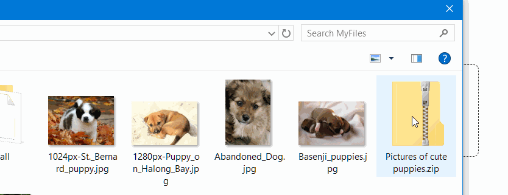

&nbsp;&nbsp;&nbsp;



# 📤 dash-uploader

The upload package for [Dash](https://dash.plotly.com/) applications using large data files. 


## Short summary
&nbsp;&nbsp;&nbsp;&nbsp;&nbsp; 💾 Data file size has no limits. (Except the hard disk size)<bR>
&nbsp;&nbsp;&nbsp;&nbsp;&nbsp; ☎ Call easily a callback after uploading is finished.<br>
&nbsp;&nbsp;&nbsp;&nbsp;&nbsp; 📤 Upload files using [resumable.js](https://github.com/23/resumable.js) <br>
&nbsp;&nbsp;&nbsp;&nbsp;&nbsp; 📦 All JS and CSS bundled with the package. No need for network calls for CSS/JS.<br>
&nbsp;&nbsp;&nbsp;&nbsp;&nbsp; ✅ Works with Dash 1.1.0.+ & Python 3.6+. (Possibly with other versions, too)<br>


### dash-uploader vs. [dcc.Upload](https://dash.plotly.com/dash-core-components/upload)


|                       | dash-uploader                                      | [dcc.Upload](https://dash.plotly.com/dash-core-components/upload)                                                                                                                    |
| --------------------- | -------------------------------------------------- | ------------------------------------------------------------------------------------------------------------------------------------------------------------------------------------ |
| Underlying technology | [resumable.js](http://www.resumablejs.com/)        | HTML5 API                                                                                                                                                                            |
| File size             | Unlimited                                          | max ~150-200Mb ([link](https://community.plotly.com/t/dash-upload-component-decoding-large-files/8033/11))                                                                           |
| Uploads to            | Hard disk (server side)                            | First to browser memory (user side) Then, to server using callbacks.                                                                                                                 |
| Data type             | Uploaded as file; no need to parse at server side. | Uploaded as byte64 encoded string  -> Needs parsing                                                                                                                                  |
| See upload progress?  | Progressbar out of the box                         | No upload indicators out of the box. Generic loading indicator possible. [Progressbar not possible](https://community.plotly.com/t/upload-after-confirmation-and-progress-bar/7172). |

# Installing
```
pip install dash-uploader
```

# Usage

⚠️**Security note**: The Upload component allows uploads of arbitrary files to arbitrary subfolders (if using raw XHR requests and `use_upload_id` is True) and one should take this into account (with user token checking etc.) if used as part of a public website!

## Simple example

```python
import dash
import dash_html_components as html
import dash_uploader as du

app = dash.Dash(__name__)

# 1) configure the upload folder
du.configure_upload(app, r"C:\tmp\Uploads")

# 2) Use the Upload component
app.layout = html.Div([
    du.Upload(),
])

if __name__ == '__main__':
    app.run_server(debug=True)

```

## Example with callback

- **New in version 0.2.0:** The configure_upload accepts additional parameter `use_upload_id`, which is a boolean flag (Defaults to True). When True, the uploaded files are put into subfolders `<upload_folder>/<upload_id>`. This way different users can be forced to upload to different folders. 

```python
from pathlib import Path
import uuid

import dash_uploader as du
import dash
import dash_html_components as html
from dash.dependencies import Input, Output, State

app = dash.Dash(__name__)

UPLOAD_FOLDER_ROOT = r"C:\tmp\Uploads"
du.configure_upload(app, UPLOAD_FOLDER_ROOT)


def get_upload_component(id):
    return du.Upload(
        id=id,
        text='Drag and Drop files here',
        text_completed='Completed: ',
        cancel_button=True,
        max_file_size=1800,  # 1800 Mb
        filetypes=['zip', 'rar'],
        upload_id=uuid.uuid1(),  # Unique session id
    )


def get_app_layout():

    return html.Div(
        [
            html.H1('Demo'),
            html.Div(
                [
                    get_upload_component(id='dash-uploader'),
                    html.Div(id='callback-output'),
                ],
                style={  # wrapper div style
                    'textAlign': 'center',
                    'width': '600px',
                    'padding': '10px',
                    'display': 'inline-block'
                }),
        ],
        style={
            'textAlign': 'center',
        },
    )


# get_app_layout is a function
# This way we can use unique session id's as upload_id's
app.layout = get_app_layout


@app.callback(
    Output('callback-output', 'children'),
    [Input('dash-uploader', 'isCompleted')],
    [State('dash-uploader', 'fileNames'),
     State('dash-uploader', 'upload_id')],
)
def callback_on_completion(iscompleted, filenames, upload_id):
    if not iscompleted:
        return

    out = []
    if filenames is not None:
        if upload_id:
            root_folder = Path(UPLOAD_FOLDER_ROOT) / upload_id
        else:
            root_folder = Path(UPLOAD_FOLDER_ROOT)

        for filename in filenames:
            file = root_folder / filename
            out.append(file)
        return html.Ul([html.Li(str(x)) for x in out])

    return html.Div("No Files Uploaded Yet!")


if __name__ == '__main__':
    app.run_server(debug=True)

```
**Notes for the example:**
- The `callback_on_completion`-function is called after each upload.
- The `isCompleted` property will be set to `True`, when upload is finished.
- The `fileNames` property (list of str) have the name of the uploaded file. Note that in current version, *only one file can be uploaded at the time*, and the length of this list is one.
- The `upload_id` property (str) is used to distinguish different users/sessions. In the example above, a simple [uuid.uuid1()](https://docs.python.org/3/library/uuid.html#uuid.uuid1) is used, which can be also converted back to a timestamp. This way, uploads with same filename from different users will be in different folders.  (new in **v.0.2.0**)


## Contributing

| What?                                | How?                                                                                                                                                                                                                                         |
| ------------------------------------ | -------------------------------------------------------------------------------------------------------------------------------------------------------------------------------------------------------------------------------------------- |
| 🐞 Found a bug?                       | 🎟 <a href="https://github.com/np-8/dash-uploader/issues">File an Issue</a>                                                                                                                                                                   |
| 🙋‍♂️ Need help?                         | ❔  <a href="https://stackoverflow.com/questions/ask">Ask a question on StackOverflow</a> <br><a href="https://community.plotly.com/t/show-and-tell-dash-uploader-upload-large-files/38451">📧 Use this thread on community.plotly.com</a>     |
| 💡  Want to submit a feature request? | <a href="https://community.plotly.com/t/show-and-tell-dash-uploader-upload-large-files/38451">🎭 Discuss about it on community.plotly.com</a><br><a href="https://github.com/np-8/dash-uploader/issues">🎫 File an Issue (feature request)</a> |
| 🧙  Want to write code?               | 🔥 <a href="./docs/CONTRIBUTING.md">Here's how you get started!</a>                                                                                                                                                                           |


## Changelog

See [CHANGELOG.md](./docs/CHANGELOG.md)

## Credits
- History: This package is based on the React 16 compatible version [dash-resumable-upload](https://github.com/westonkjones/dash-resumable-upload) (0.0.4) by [Weston Jones](https://github.com/westonkjones/) which in turn is based on [dash-resumable-upload](https://github.com/rmarren1/dash-resumable-upload) (0.0.3) by [Ryan Marren](https://github.com/rmarren1) 
- The package boilerplate is taken from the [dash-component-boilerplate](https://github.com/plotly/dash-component-boilerplate).
- The uploading JS function utilizes the [resumable.js](http://www.resumablejs.com/) (1.1.0).
- The JS component is created using [React](https://github.com/facebook/react) (16.8.6)
- The CSS styling is mostly from [Bootstrap](https://getbootstrap.com/) 4.